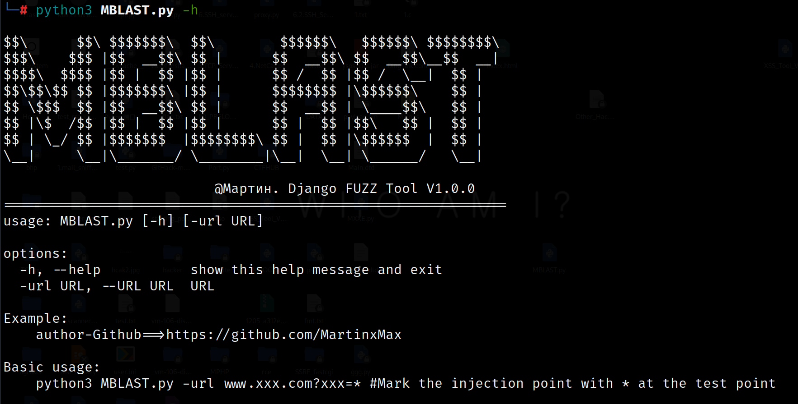
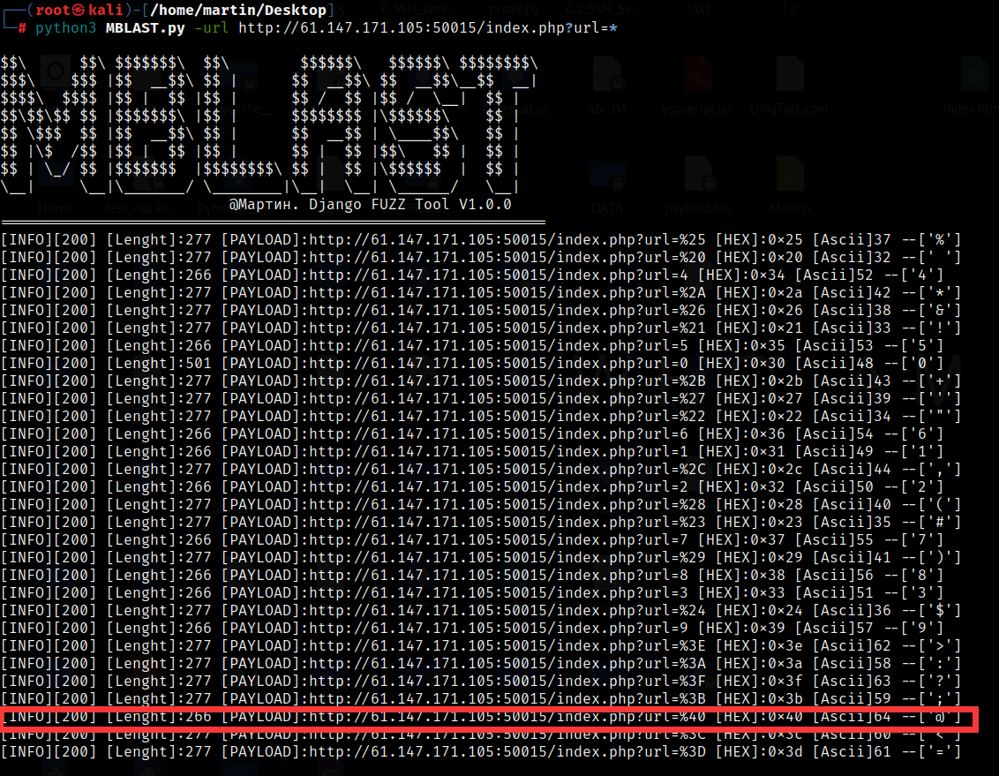

<div align="center">
 
 <p align="center">
 
 
  
 
 
 </p>
  
 <table>
  <tr>
      <th>Function</th>
  </tr>
  <tr>
    <th>Sensitive character filtering detection analysis</th>
  </tr>
 </table>
</div>

## usage method

 * View help information

      ```#python3 MBLAST.py -h```

    
  
## Use * to mark URL test points

   ```#python3 MBLAST.py -url xxx.com?abc=*```

   